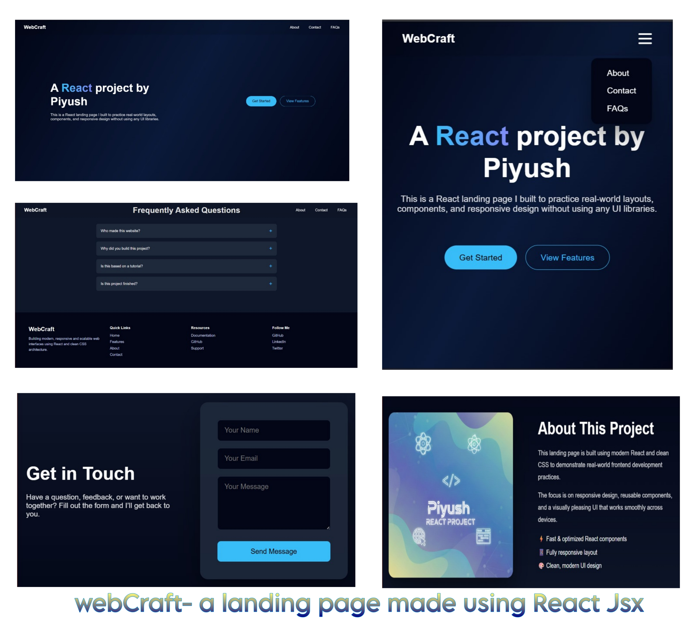

# WebCraft – Responsive Landing Page

UIForge is a modern and responsive landing page developed using React JSX and CSS.  
The project focuses on clean UI design, smooth navigation, and mobile-first responsiveness.

## 🚀 Features

- Fully responsive design (mobile, tablet, desktop)
- Sticky navigation bar
- Smooth scrolling between sections
- Clean and modern user interface
- Reusable React components

## 🛠 Tech Stack

- React
- JavaScript
- HTML
- CSS

## 🌐 Live Demo

https://landing-page-piyush.netlify.app/

## 📌 Project Purpose

This project was developed to practice responsive web design, component-based architecture, and deployment of React applications.

## 📷 Preview

## 📄 License

This project is for learning and demonstration purposes.
